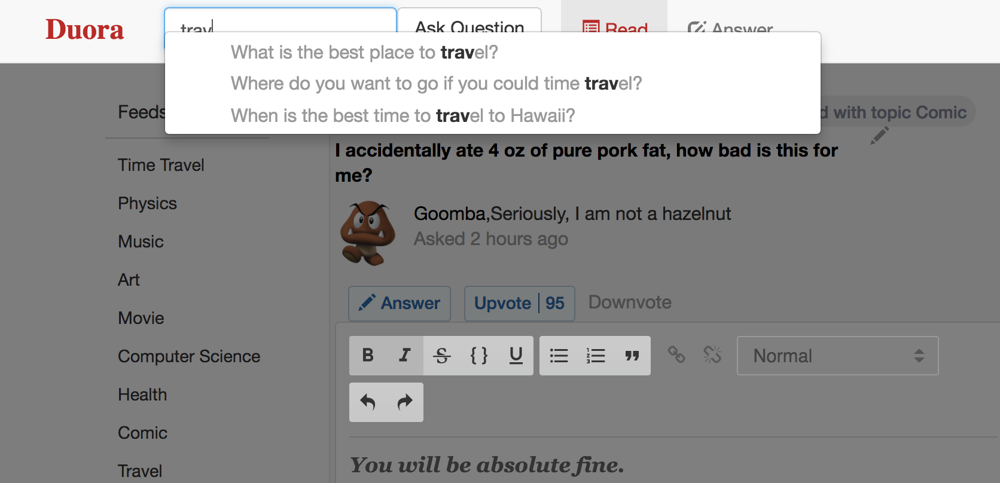
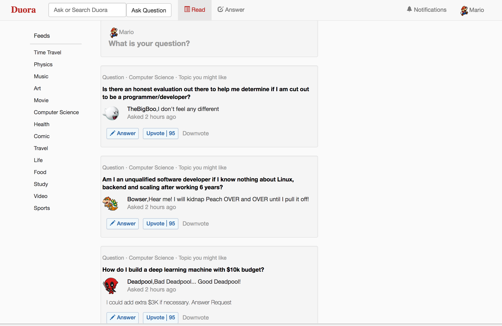
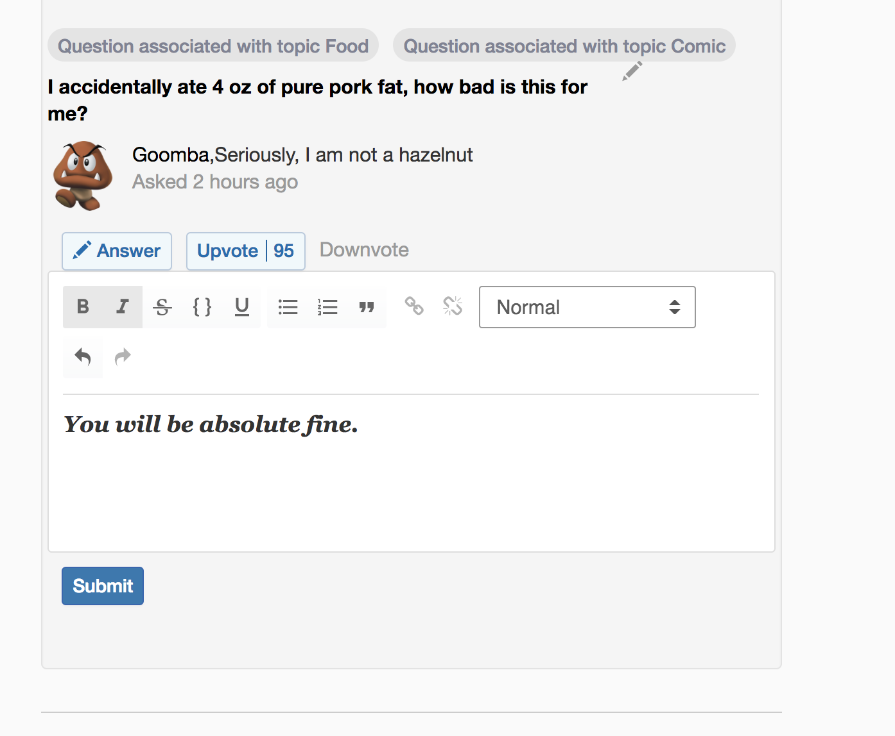

Duora

[Live link][heroku]

[heroku]: https://duora.herokuapp.com/

Duora is a full-stack web application inspired by Quora. It utilizes React.js with a Redux architectural framework on the frontend, styled with bootstrap CSS, a PostgreSQL database Ruby on Rails on the backend.

Features & Implementation

Questions Searching and Rendering

On the database side, each question is stored in one table in the database, which contains attributes to id, user_id, title, body, created_at and updated_at. Upon login, an API call is made to the database to fetch all the questions.

Searching questions is a standard feature of Quora. Users could use the search bar on the navigation bar to ask or search a question, or could use the middle upper area in the main page for more detailed question creation. Search functionality is implemented with ActiveRecord query methods to search all questions. This search, which is case insensitive, will look through titles of all questions for matching results, which will be bolded.

The challenge of search feature is to not interfere with QuestionIndexComponents, Which at first were listened to the same piece of state. After separating searching result store as an array of searched questions Ids, each search result is now separated with QuestionIndexComponents.

Questions are rendered in two different components: the QuestionIndex components, which show the title, author, topic, body , and the QuestionDetail components, which are displayed in question show page will display all answers to the specific question and all comments to corresponding answers.

Answers

Each answer, which contains attributes to id, question_id, author_id, body, is referenced to a specific question. Each answer belongs to a question and an author.
RichTestEditor is used to implemented creating answers upon clicking the toggle answer button with Modal effect.

The React component structure for answers is similar as that of questions: the AnswerIndex component renders a list of Answers as subcomponents.

Comments

As with questions and answers, comments are stored in the database. The tag table contains the columns id, answer_id, and author_id. Each comment is referenced to an answer. The Component structure of comments is similar as questions and answers.

Future Directions for the Project

In addition to the features I have already implement, I will continue to work on this project. The future steps for Duora are stated below.

Comment on Comments

Edit and Update

User Profile with User Statistics

Upvote / Downvote / Subscribe/ Unsubscribe questions, answers, and comments

Since Duora is a website for asking and answering. User may follow many questions. User Profile page could display user statistics about subscribing questions.
